# 화면 정의서

## 1. 화면 목록

# 화면 정의서

## 로그인/회원가입

| 화면명   | 목적                       | 주요 요소                                                                                                                                                                      |
| -------- | -------------------------- | ------------------------------------------------------------------------------------------------------------------------------------------------------------------------------ |
| 로그인   | 사용자 인증 및 서비스 진입 | • 이메일 입력 필드 • 비밀번호 입력 필드 • 로그인 버튼 • 회원가입 이동 링크 • 이메일/비밀번호 형식 검증 및 에러 메시지                                              |
| 회원가입 | 신규 사용자 계정 생성      | • 이메일 입력 필드 (중복 체크) • 비밀번호 입력 필드 (최소 8자, 영문+숫자 조합) • 비밀번호 확인 필드 • 가입 버튼 • 로그인 이동 링크 • 유효성 검증 및 안내 메시지 |
| 로그아웃 | 사용자 세션 종료           | • 로그아웃 버튼 (클릭 시 로그인 페이지로 이동)                                                                                                                                 |

---

## 마이 페이지

| 화면명      | 목적                    | 주요 요소                                                                                                                     |
| ----------- | ----------------------- | ----------------------------------------------------------------------------------------------------------------------------- |
| 프로필 상세 | 사용자 프로필 정보 확인 | • 프로필 이미지 • 닉네임, 아이디, 지역, 나이, 성별 • 내 소개 • 북마크 버튼 • 모임 조회 버튼 • 프로필 수정 버튼 |
| 프로필 수정 | 사용자 프로필 정보 편집 | • 프로필 이미지 업로드 • 닉네임, 아이디(이메일), 비밀번호, 지역, 성별 수정 필드 • 저장 버튼 • 취소 버튼              |
| 북마크      | 저장한 모임 목록 확인   | • 북마크한 모임 리스트 • 모임 클릭 시 상세 페이지 이동                                                                     |
| 모임 조회   | 참여/주최한 모임 관리   | • 주최한 모임 목록 • 참여한 모임 목록 • 필터 기능 (참여 전/후) • 모임 클릭 시 상세 페이지 이동                       |

---

## 메인 홈

| 화면명  | 목적                          | 주요 요소                                                                                                                                                                                                                                                                                                                                        |
| ------- | ----------------------------- | ------------------------------------------------------------------------------------------------------------------------------------------------------------------------------------------------------------------------------------------------------------------------------------------------------------------------------------------------ |
| 메인 홈 | 서비스 소개 및 주요 기능 접근 | • 헤더 (로고, 리스트, 북마크 링크) • 메인 배너 (서비스 소개) • 지도 미리보기 (클릭 시 지도 페이지 이동) • 추천 모임 리스트 (4개, 북마크 버튼 포함) • 검색 바 (검색어 입력 시 리스트 페이지 이동) • 카테고리 버튼 • 푸터 (회사 정보, 고객센터, 커리어, 자주 묻는 질문) • AI 모임 추천 버튼 (MBTI 또는 사용자 행동 패턴 기반) |

---

## 지도

| 화면명 | 목적                  | 주요 요소                                                                                 |
| ------ | --------------------- | ----------------------------------------------------------------------------------------- |
| 지도   | 지역별 모임 위치 확인 | • 지도 인터페이스 • 모임 위치 마커 • 모임 클릭 시 기본 정보 팝업 (제목, 지역, 날짜) |

---

## 모임 리스트

| 화면명      | 목적                   | 주요 요소                                                                                                                                                                           |
| ----------- | ---------------------- | ----------------------------------------------------------------------------------------------------------------------------------------------------------------------------------- |
| 모임 리스트 | 전체 모임 탐색 및 검색 | • 카테고리 탭 (파티, 음식, 여행, 동물 등) • 모임 카드 (제목, 지역, 날짜, 성별, 나이대, 카테고리, 인원) • 모임 등록하기 버튼 • 검색 필터 • 페이지네이션 또는 무한 스크롤 |

---

## 모임 상세

| 화면명    | 목적                             | 주요 요소                                                                                                                                                                                                                                                                                                                                                                                                                                  |
| --------- | -------------------------------- | ------------------------------------------------------------------------------------------------------------------------------------------------------------------------------------------------------------------------------------------------------------------------------------------------------------------------------------------------------------------------------------------------------------------------------------------ |
| 모임 상세 | 모임 정보 상세 확인 및 참여 신청 | • 시간, 제목, 카테고리, 내용, 장소, 성별, 나이대, 인원 (최소/최대) • 모임 신청 버튼 (추천자 프로필 아래 또는 오른쪽) • 참여자 관리 버튼 (주최자만 표시) • 삭제 버튼 (경고 팝업 후 확인/취소) • 수정 버튼 (이미지, 제목, 지역, 날짜, 내용, 인원 수정 가능) • 주최자 프로필 (클릭 시 모달 형태로 상세 표시) • 북마크 버튼 • 채팅 버튼 (주최자와 대화) • AI 코디 추천 버튼 • 후기 섹션 (주최자에 대한 간략한 후기) |

---

## 모임 등록

| 화면명    | 목적                | 주요 요소                                                                                                                                                                                                                                                                                      |
| --------- | ------------------- | ---------------------------------------------------------------------------------------------------------------------------------------------------------------------------------------------------------------------------------------------------------------------------------------------- |
| 모임 등록 | 새로운 모임 생성    | • 제목, 내용, 이미지 업로드 • 날짜, 지역, 최대인원 입력 • 카테고리 선택 • 질문지 작성 (예: 신청 이유) • 성별, 나이대, 인원 (최소/최대) 설정 • 저장 버튼 (작성 완료 후 상세 페이지 이동) • 취소 버튼 (리스트 페이지로 이동) • 불러오기 버튼 (이전 주최 모임 내용 불러오기) |
| 모임 수정 | 기존 모임 내용 수정 | • 기존 모임 정보 불러오기 기능 • 제목, 내용, 이미지, 날짜, 지역, 카테고리, 인원 수정 • 등록 버튼 (수정 완료 후 상세 페이지 이동) • 취소 버튼                                                                                                                                          |

---

## 신청

| 화면명    | 목적                        | 주요 요소                                                                                                                     |
| --------- | --------------------------- | ----------------------------------------------------------------------------------------------------------------------------- |
| 모임 신청 | 모임 참여 신청 및 질문 답변 | • 주최자가 설정한 질문 목록 • 답변 입력 필드 • 신청 버튼 (공백 시 에러 메시지, 완료 시 상세 페이지 이동) • 취소 버튼 |

---

## 참여자 관리

| 화면명      | 목적                       | 주요 요소                                                                                                                 |
| ----------- | -------------------------- | ------------------------------------------------------------------------------------------------------------------------- |
| 참여자 관리 | 모임 신청자 승인/거절 관리 | • 참여자 정보 목록 • 참여자가 작성한 질문지 내용 • 승인 버튼 (클릭 시 알림 전송) • 거절 버튼 (클릭 시 알림 전송) |

---

## 북마크

| 화면명      | 목적             | 주요 요소                                                                                                                                        |
| ----------- | ---------------- | ------------------------------------------------------------------------------------------------------------------------------------------------ |
| 북마크 상세 | 저장한 모임 관리 | • 북마크한 모임 카드 (제목, 지역, 날짜, 성별, 나이대) • 모임 클릭 시 상세 페이지 이동 • 북마크 취소 버튼 • 취소된 모임 회색 톤으로 표시 |

---

## 모임 조회

| 화면명    | 목적                       | 주요 요소                                                                                                |
| --------- | -------------------------- | -------------------------------------------------------------------------------------------------------- |
| 모임 조회 | 내가 주최/참여한 모임 확인 | • 주최한 모임 탭 • 참여한 모임 탭 • 필터 기능 (참여 전/참여 후) • 모임 클릭 시 상세 페이지 이동 |

---

## 알림

| 화면명 | 목적                        | 주요 요소                                                                                               |
| ------ | --------------------------- | ------------------------------------------------------------------------------------------------------- |
| 알림   | 모임 관련 알림 수신 및 확인 | • 모임 참가 승인/거절 알림 • 모임 후기 알림 (추후) • 알림 목록 • 알림 클릭 시 관련 페이지 이동 |

---

## FAQ

| 화면명         | 목적                       | 주요 요소                                                                                |
| -------------- | -------------------------- | ---------------------------------------------------------------------------------------- |
| 자주 묻는 질문 | 기본적인 질문 및 답변 제공 | • 질문 리스트 (기본적인 질문만 등록) • 질문 클릭 시 답변 확장 • 검색 기능 (선택적) |

## 2. 화면 흐름

### 비회원 사용자 흐름

- 메인 홈 → 모임 리스트 조회 → 모임 상세 확인
- 메인 홈 → 지도 확인 → 모임 위치 탐색

### 회원 사용자 흐름 (로그인 후)

- 로그인 → 메인 홈 → 모임 리스트 → 모임 상세 → 모임 신청
- 로그인 → 메인 홈 → 모임 등록 → 모임 상세
- 로그인 → 마이페이지 → 프로필 수정/북마크/모임 조회
- 로그인 → 모임 리스트 → 모임 북마크 → 북마크 목록 확인

### 주최자 흐름

- 로그인 → 모임 등록 → 모임 상세 → 참여자 관리 → 승인/거절
- 로그인 → 마이페이지 → 모임 조회 → 모임 수정/삭제

### 참여자 흐름

- 로그인 → 모임 리스트 → 모임 상세 → 모임 신청 → 질문지 작성
- 로그인 → 알림 확인 → 승인/거절 결과 확인

## 3. 화면별 상세

### 3.1 로그인

**입력 항목**

- 이메일 (형식 검증)
- 비밀번호

**행동**

- 로그인 버튼 클릭 → 메인 홈으로 이동
- 회원가입 링크 클릭 → 회원가입 화면으로 이동

**상태**

- 에러 메시지 (이메일 형식 오류, 계정 없음, 비밀번호 불일치)
- 로딩 상태

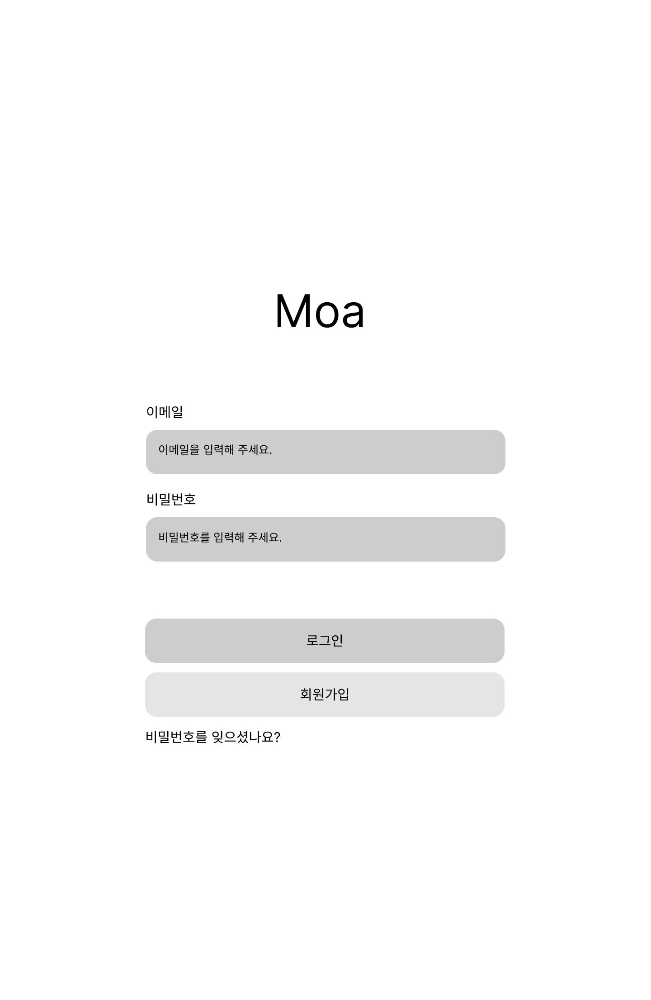

### 3.2 회원가입

**입력 항목**

- 이메일 (중복 체크)
- 비밀번호 (최소 8자, 영문+숫자 조합)
- 비밀번호 확인

**행동**

- 가입 버튼 클릭 → 로그인 화면으로 이동
- 로그인 링크 클릭 → 로그인 화면으로 이동

**상태**

- 이메일 중복 오류 메시지
- 비밀번호 규칙 위반 오류 메시지
- 비밀번호 불일치 오류 메시지

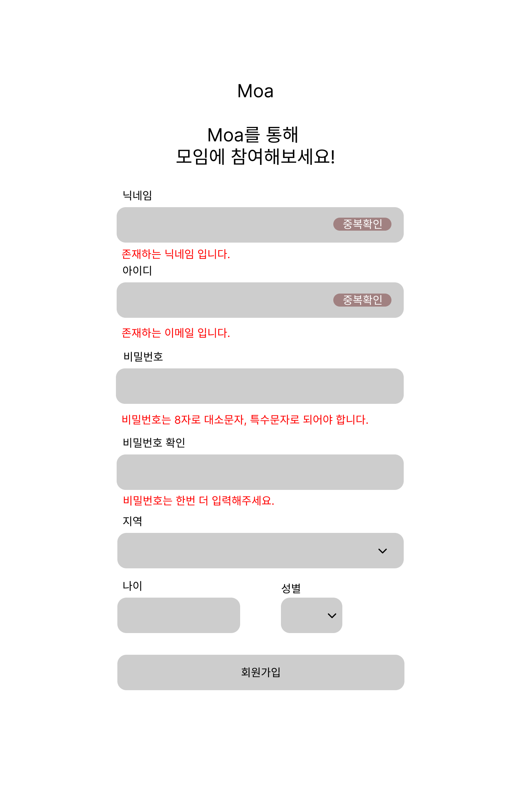

### 3.3 메인 홈

**구성**

- 헤더 (로고, 리스트, 북마크 링크)
- 메인 배너 (서비스 소개 섹션)
- 검색 바 (검색어 입력 필드, 카테고리 버튼)
- 지도 미리보기
- 추천 모임 리스트 (4개)
- 푸터 (회사 정보, 고객센터, 커리어, FAQ)

**행동**

- 로고 클릭 → 메인 홈으로 이동
- 검색어 입력 후 검색 → 모임 리스트로 이동
- 카테고리 클릭 → 해당 카테고리 모임 리스트로 이동
- 지도 클릭 → 지도 페이지로 이동
- 추천 모임 클릭 → 모임 상세로 이동
- 북마크 버튼 클릭 → 북마크 추가/제거
- AI 추천 버튼 클릭 → MBTI/행동 패턴 기반 모임 추천

**상태**

- 로그인 상태 / 비로그인 상태 (헤더 UI 변경)

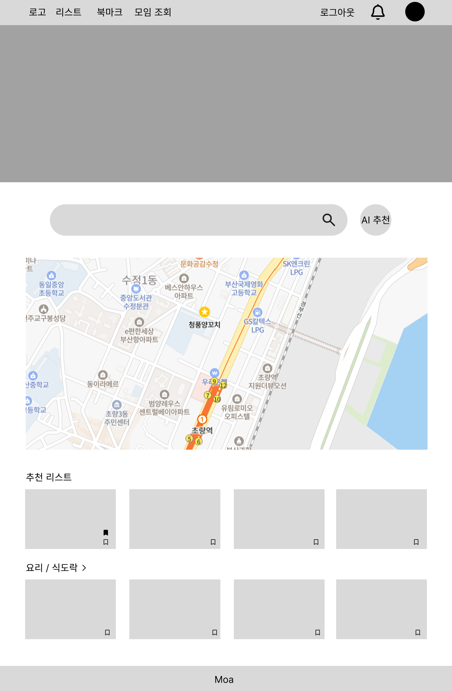

### 3.4 모임 리스트

**구성**

- 카테고리 탭 (파티, 음식, 여행, 동물 등)
- 검색 필터
- 모임 카드 목록 (제목, 지역, 날짜, 성별, 나이대, 카테고리, 인원)
- 모임 등록하기 버튼
- 페이지네이션 또는 무한 스크롤

**행동**

- 카테고리 탭 클릭 → 해당 카테고리 모임 필터링
- 검색 필터 적용 → 조건에 맞는 모임 표시
- 모임 카드 클릭 → 모임 상세로 이동
- 등록하기 버튼 클릭 → 모임 등록 페이지로 이동
- 북마크 버튼 클릭 → 북마크 추가/제거

**상태**

- 검색 결과 없음 안내 메시지
- 로딩 상태

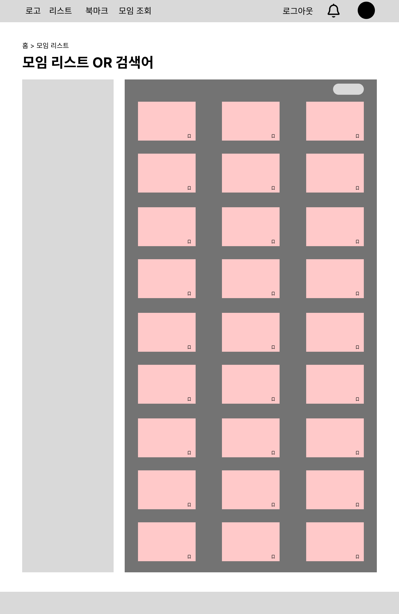

### 3.5 모임 상세

**구성**

- 모임 정보 (제목, 시간, 날짜, 장소, 카테고리, 성별, 나이대, 인원)
- 모임 상세 내용
- 주최자 프로필 (이미지, 닉네임, 간단한 소개)
- 모임 신청 버튼
- 북마크 버튼
- 수정/삭제 버튼 (주최자만)
- 참여자 관리 버튼 (주최자만)
- 채팅 버튼
- AI 코디 추천 버튼
- 후기 섹션

**행동**

- 모임 신청 버튼 클릭 → 신청 페이지로 이동
- 주최자 프로필 클릭 → 프로필 모달 표시
- 북마크 버튼 클릭 → 북마크 추가/제거
- 수정 버튼 클릭 → 모임 수정 페이지로 이동
- 삭제 버튼 클릭 → 확인 팝업 후 삭제 및 리스트로 이동
- 참여자 관리 클릭 → 참여자 관리 페이지로 이동
- 채팅 버튼 클릭 → 주최자와 채팅 시작
- AI 코디 추천 클릭 → 모임에 맞는 코디 추천

**상태**

- 주최자 여부에 따른 버튼 표시/숨김
- 모임 신청 완료 상태
- 모임 마감 상태

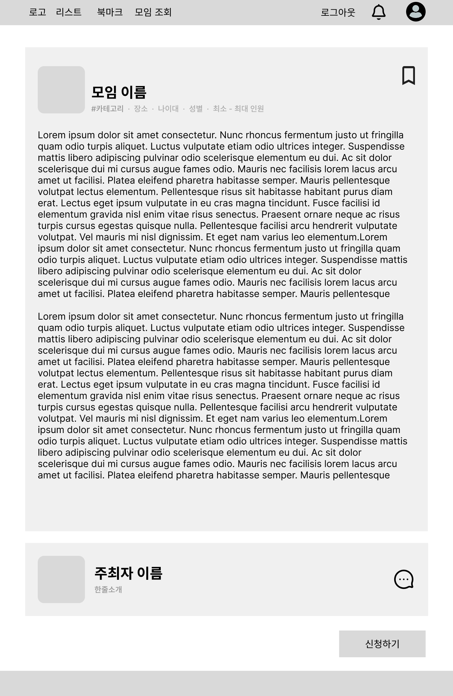

### 3.6 모임 등록/수정

**구성**

- 제목 입력 필드
- 내용 입력 필드 (텍스트 에디터)
- 이미지 업로드
- 날짜 선택
- 지역 선택
- 카테고리 선택
- 성별, 나이대 선택
- 최소/최대 인원 설정
- 질문지 작성 (신청자에게 받을 질문)
- 저장 버튼
- 취소 버튼
- 불러오기 버튼 (이전 모임 내용)

**행동**

- 저장 버튼 클릭 → 모임 상세 페이지로 이동
- 취소 버튼 클릭 → 모임 리스트로 이동
- 불러오기 버튼 클릭 → 이전 주최 모임 선택 및 내용 불러오기

**상태**

- 필수 입력 항목 미입력 시 에러 메시지
- 이미지 업로드 진행 상태
- 저장 중 로딩 상태

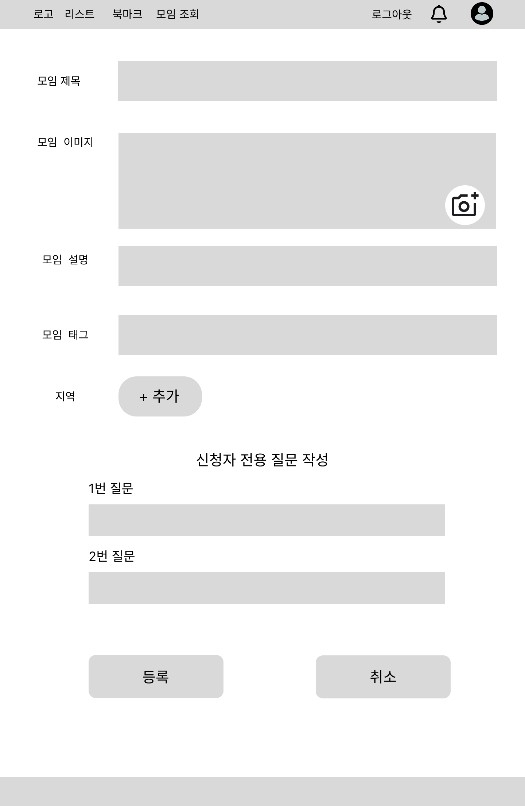

### 3.7 모임 신청

**구성**

- 모임 정보 요약 (제목, 날짜, 장소, 인원 등)
- 주최자 질문 목록
- 답변 입력 필드
- 신청 버튼
- 취소 버튼

**행동**

- 신청 버튼 클릭 → 답변 검증 후 모임 상세로 이동
- 취소 버튼 클릭 → 모임 상세로 이동

**상태**

- 답변 미입력 시 에러 메시지
- 신청 완료 메시지

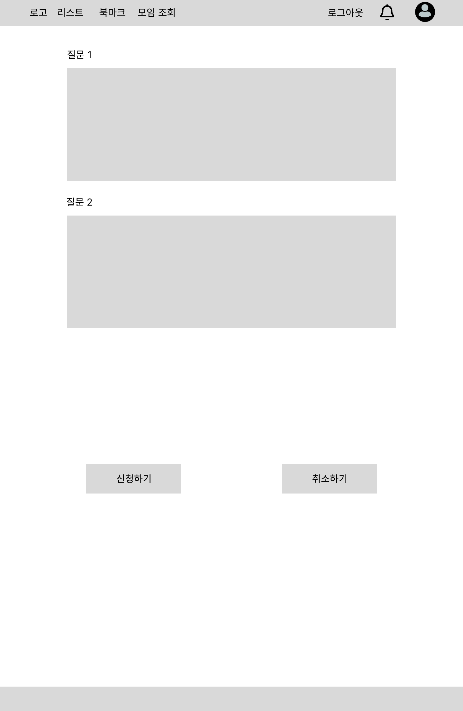

### 3.8 참여자 관리

**구성**

- 신청자 목록 (프로필 이미지, 닉네임, 신청일)
- 신청자가 작성한 질문지 답변
- 승인 버튼
- 거절 버튼
- 필터 (대기 중/승인됨/거절됨)

**행동**

- 신청자 클릭 → 질문지 답변 확인
- 승인 버튼 클릭 → 신청자에게 알림 전송
- 거절 버튼 클릭 → 신청자에게 알림 전송

**상태**

- 승인/거절 처리 중 로딩 상태
- 참여자 없음 안내 메시지

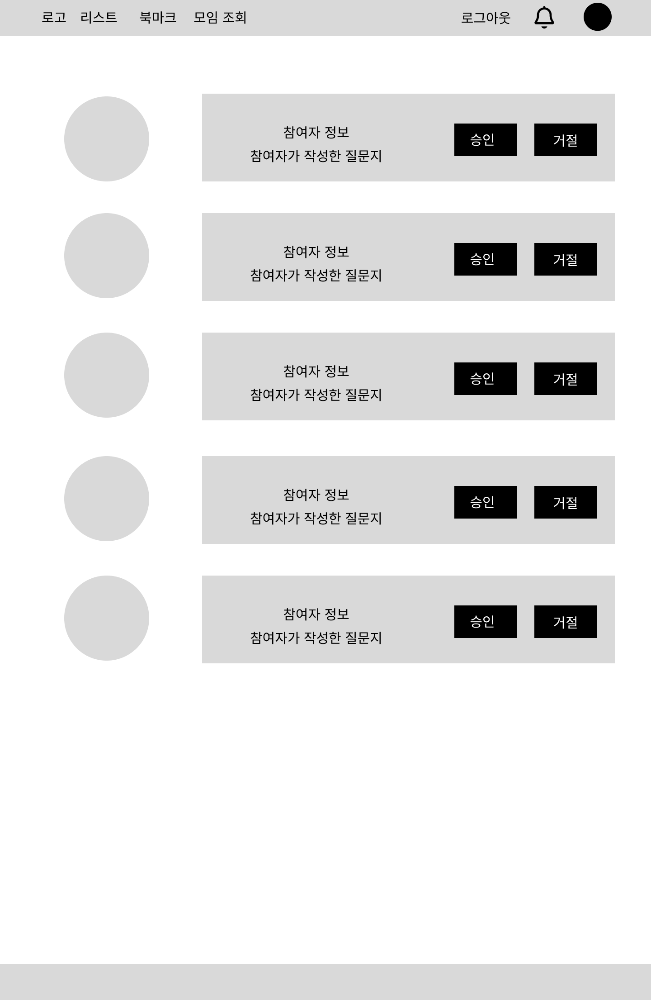

### 3.9 마이페이지 - 프로필 상세

**구성**

- 프로필 이미지
- 닉네임, 아이디, 지역, 나이, 성별
- 내 소개
- 프로필 수정 버튼
- 북마크 버튼
- 모임 조회 버튼

**행동**

- 프로필 수정 버튼 클릭 → 프로필 수정 페이지로 이동
- 북마크 버튼 클릭 → 북마크 목록으로 이동
- 모임 조회 버튼 클릭 → 모임 조회 페이지로 이동

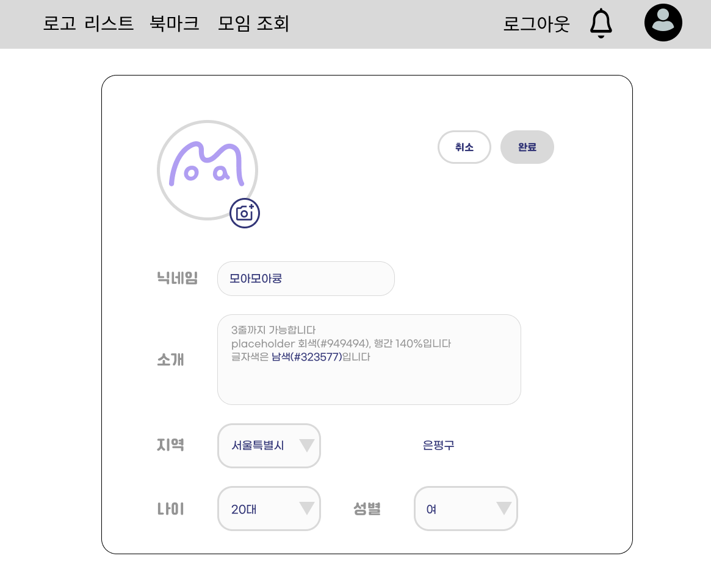

### 3.10 마이페이지 - 프로필 수정

**구성**

- 프로필 이미지 업로드
- 닉네임 입력 필드
- 아이디(이메일) 표시 (수정 불가)
- 비밀번호 변경 필드
- 지역 선택
- 성별 선택
- 저장 버튼
- 취소 버튼

**행동**

- 저장 버튼 클릭 → 프로필 상세로 이동
- 취소 버튼 클릭 → 프로필 상세로 이동

**상태**

- 필수 입력 항목 미입력 시 에러 메시지
- 저장 완료 메시지

### 3.11 북마크

**구성**

- 북마크한 모임 카드 목록 (제목, 지역, 날짜, 성별, 나이대)
- 북마크 취소 버튼
- 필터/정렬 옵션

**행동**

- 모임 카드 클릭 → 모임 상세로 이동
- 북마크 취소 버튼 클릭 → 북마크 제거 (회색 톤으로 표시)

**상태**

- 북마크 없음 안내 메시지
- 취소된 모임 회색 톤 표시

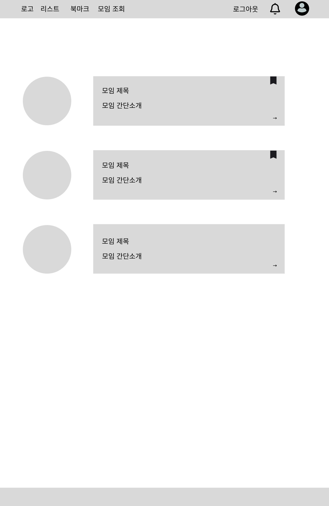

### 3.12 모임 조회

**구성**

- 탭 (주최한 모임 / 참여한 모임)
- 필터 (참여 전 / 참여 후)
- 모임 카드 목록

**행동**

- 탭 전환 → 주최/참여 모임 목록 표시
- 필터 적용 → 조건에 맞는 모임 표시
- 모임 카드 클릭 → 모임 상세로 이동

**상태**

- 모임 없음 안내 메시지

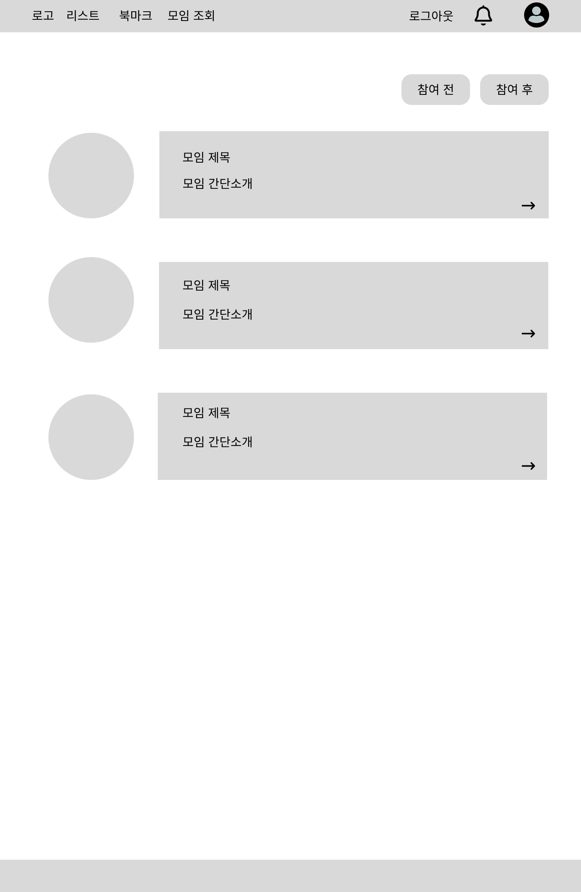

### 3.13 지도

**구성**

- 지도 인터페이스 (카카오맵 또는 네이버 지도)
- 모임 위치 마커
- 모임 정보 팝업 (제목, 지역, 날짜, 인원 등)

**행동**

- 마커 클릭 → 모임 정보 팝업 표시
- 팝업 내 모임 클릭 → 모임 상세로 이동
- 지도 이동/확대/축소

**상태**

- 지도 로딩 상태
- 해당 지역 모임 없음 안내

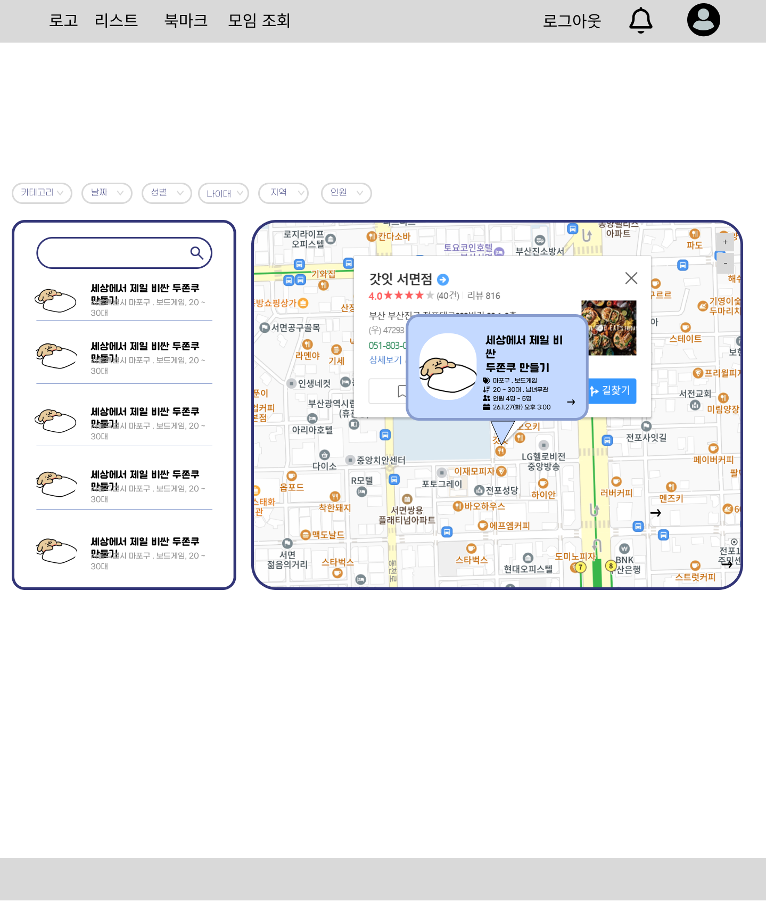

### 3.14 알림

**구성**

- 알림 목록 (시간순 정렬)
- 알림 타입 (승인/거절/후기 등)
- 읽음/안읽음 표시

**행동**

- 알림 클릭 → 관련 페이지로 이동 (모임 상세, 참여자 관리 등)
- 알림 삭제

**상태**

- 알림 없음 안내 메시지
- 읽지 않은 알림 강조 표시

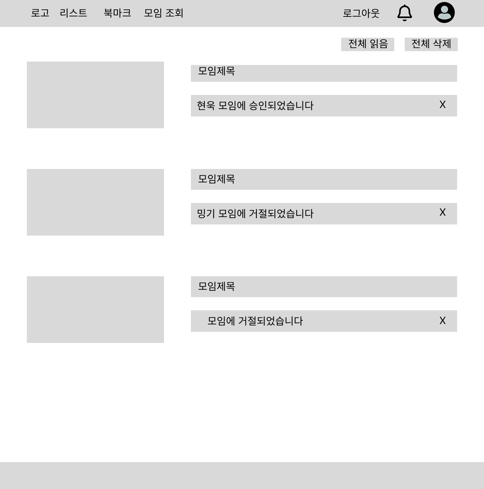

### 3.15 FAQ

**구성**

- 질문 카테고리 (서비스 이용, 모임 참여 등)
- 질문 목록
- 답변 확장/축소
- 검색 기능

**행동**

- 질문 클릭 → 답변 확장/축소
- 검색어 입력 → 관련 질문 필터링

**상태**

- 검색 결과 없음 안내 메시지
